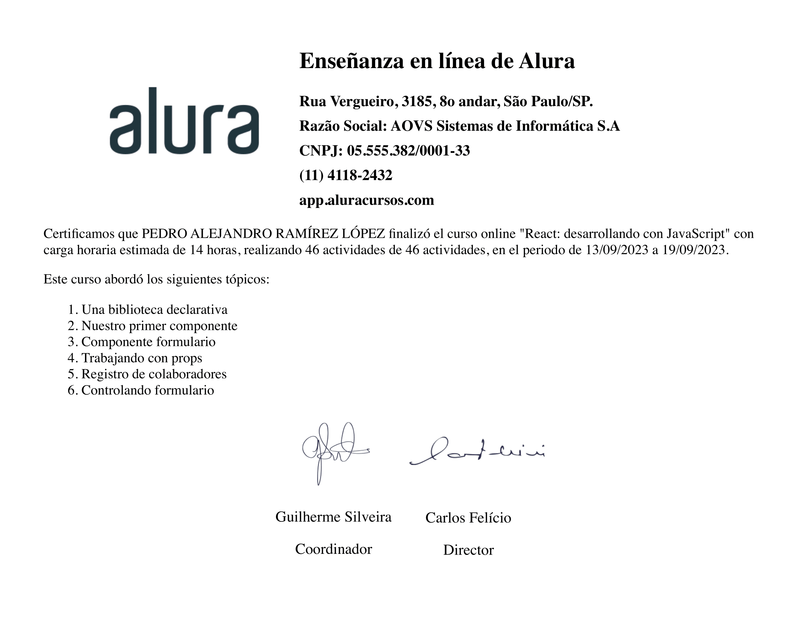

<h1 align="center">GroupApp with React + Vite</h1>

In this project, we used the powerful combination of React + Vite to develop a modern and efficient web application. Our application is based on a number of key methodologies and methods that have been fundamental to the success of its development.

<h2>Methodologies applied:</h2>

<h3>Componentization:</h3> we follow React's component-based development approach. This means that we break down the user interface into small reusable units called components. This facilitates maintenance, scalability and code reusability.

Communication between components: To achieve a dynamic and highly interactive application, we have implemented inter-component communication methods. We use props (properties) to pass data from a parent component to a child component, allowing efficient transmission of information.

<h3>Methods used:</h3>
.map() method: We employ the .map() method to traverse and render lists of elements dynamically. This is especially useful when working with data coming from an API or a database. The map function allows us to create repeating components efficiently, based on available data.

.filter() method: We use the .filter() method to perform filtering and searching within our data lists. This allows users to find specific information quickly and easily, improving the user experience.

useState(): React provides us with the useState() hook to manage the state of our components. We apply it to store and update data that may change with user interaction. This ensures that the interface is updated reactively and always reflects the current state of the application.

Props: We use props to pass data from a parent component to a child component. This ensures that components are reusable and modular, as they can receive different data and behave differently depending on the properties provided.

In summary, our React + Vite project is based on componentization, communication between components and the effective use of methods such as .map(), .filter(), useState() and props. These methodologies and techniques allow us to build a dynamic and highly interactive web application that provides a smooth and efficient user experience.

This modern and organized approach allows us to maintain clean, scalable and maintainable code, which is essential for the long-term success of any web development project.

### 🤝 Contributing

Contributions are what make the open source community such an amazing place to be learn, inspire, and create. Any contributions you make are **extremely appreciated**.

1. Fork the Project
2. Create your Feature Branch (`git checkout -b feature/AmazingFeature`)
3. Commit your Changes (`git commit -m 'Add some AmazingFeature'`)
4. Push to the Branch (`git push origin feature/AmazingFeature`)
5. Open a Pull Request

<!-- CONTACT -->
### 📫 Contact   me

 
  
  
   

<!-- ACKNOWLEDGEMENTS -->
### Acknowledgements
* Alura

<h1 align="center" >🏆 Certification🏆
</h1>
<h1 align="center" >🏆 Certification🏆 Certification🏆
">🏆
</h1>
